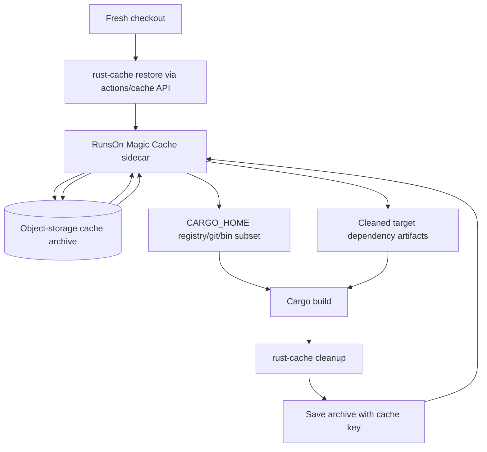
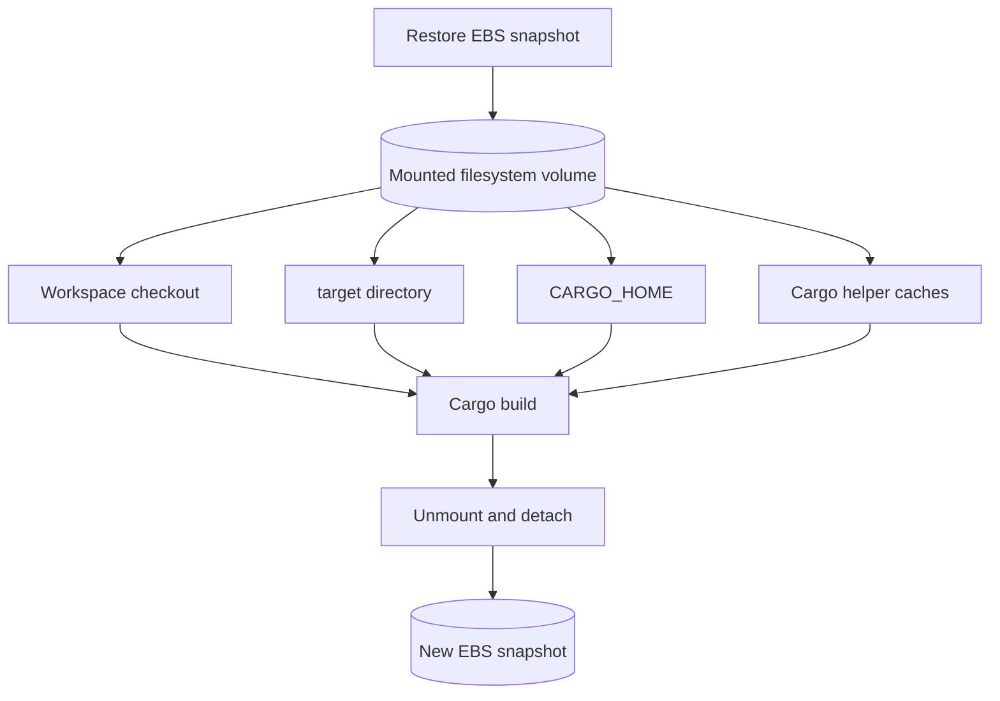

# Approaches

This is the canonical comparison of the cache approaches preserved in this archive. Individual pages keep implementation details and examples.

## Decision Matrix

| Approach | Status | Best when | Main tradeoff | Page | Example |
| --- | --- | --- | --- | --- | --- |
| `Swatinem/rust-cache` + mtime-preserving checkout | Recommended default | You want maintained/simple CI with strong repeated-run performance. | Some generated-code/build-script workspace chains can still rebuild on exact target-cache hits. | [rust-cache-mtime-checkout.md](rust-cache-mtime-checkout.md) | [workflow](../../examples/workflows/rust-cache-mtime-checkout.yml) |
| `Swatinem/rust-cache` + source-keyed target cache | Proven workaround | Repeated workspace rebuild outliers are expensive enough to justify custom cache composition. | More workflow logic and strict restore ordering. | [rust-cache-source-keyed-target-cache.md](rust-cache-source-keyed-target-cache.md) | [workflow](../../examples/workflows/rust-cache-source-keyed-target-cache.yml) |
| EBS snapshot / filesystem snapshot | Archived alternative | You need maximum local no-op fidelity and can own snapshot lifecycle complexity. | Heavier infrastructure, credential scrubbing, and snapshot scoping. | [ebs-snapshot.md](ebs-snapshot.md) | [workflow](../../examples/workflows/ebs-snapshot.yml) |
| S3 Files | Rejected for Cargo target state | You need shared file-system access for another workload. | Cargo target metadata traversal was too slow/variable for these tests. | [s3-files.md](s3-files.md) | [workflow](../../examples/workflows/s3-files-cargo-target.yml) |

## Selection Guidance

- Start with `Swatinem/rust-cache` plus the mtime-preserving cached worktree checkout.
- Move to the source-keyed target cache only when repeated generated-code/build-script rebuilds are measurable and worth the extra workflow code.
- Use filesystem snapshots only when exact Cargo no-op fidelity matters more than operational complexity.
- Do not use S3 Files for Cargo target no-op state based on these experiments; the remaining time was dominated by remote metadata/read behavior.

## Compatibility Rule

Avoid combining `Swatinem/rust-cache` with a full Cargo build-state snapshot for the same `target/` or `$CARGO_HOME` paths. `rust-cache` restores and prunes an archive-oriented subset, while a snapshot depends on preserving filesystem continuity and mtimes.

## Flow Diagrams

### `Swatinem/rust-cache` + RunsOn Magic Cache

Magic Cache changes the backend used by `actions/cache`; it does not change the semantics of what `Swatinem/rust-cache` restores, cleans, or saves.

### Filesystem Snapshot

A filesystem snapshot preserves whatever mounted subtree is placed under the snapshot root. It does not know Cargo semantics; the workflow must place the right source, Cargo home, target, and helper-cache paths under that root.
