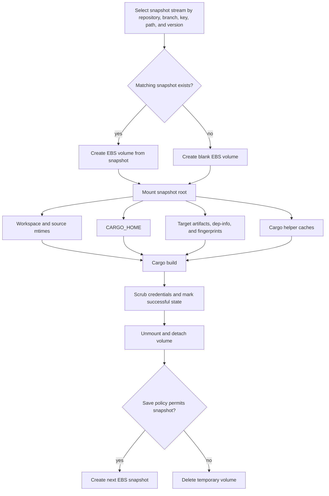

# EBS Snapshot / Filesystem Snapshot

## Summary

| Field | Value |
| --- | --- |
| Status | Archived alternative |
| Use when | Maximum local no-op fidelity matters more than infrastructure and lifecycle complexity. |
| Main tradeoff | Credential scrubbing, snapshot scope, storage lifecycle, and matrix growth require active ownership. |

## Related Files

| File | Purpose |
| --- | --- |
| [Workflow example](../../examples/workflows/ebs-snapshot.yml) | Generic snapshot-root layout for workspace, Cargo home, target, and helper caches. |
| [Snapshot action](../../examples/actions/snapshot/README.md) | Local RunsOn snapshot fork that supports keyed snapshot streams and smart saves. |
| [Cargo Lambda snapshot matrix](../../examples/workflows/cargo-lambda-snapshot-matrix.yml) | Sanitized matrix workflow using per-job snapshot keys and smart-save markers. |

## Design

```text
restore mounted filesystem snapshot
place workspace, CARGO_HOME, target, and helper caches under snapshot root
build in a stable path
save new snapshot after build
```

## Architecture



A filesystem snapshot preserves the mounted subtree as a unit. It does not know Cargo semantics; the workflow must place the workspace, Cargo home, target directory, and relevant helper caches under the snapshot root.

## Why It Works

Cargo freshness depends on a large set of mutually consistent files and metadata:

- Source files and mtimes.
- Cargo home registry/git source trees.
- Target artifacts.
- Dep-info files.
- Fingerprints.
- Build-script outputs.
- Toolchain/config/profile/feature context.

A filesystem snapshot can restore all of this as one filesystem subtree.

## Suggested Path Layout

```text
SNAPSHOT_ROOT=/mnt/build-snapshot
SNAPSHOT_WORKSPACE=/mnt/build-snapshot/workspace
CARGO_HOME=/mnt/build-snapshot/cargo-home
CARGO_TARGET_DIR=/mnt/build-snapshot/workspace/app/target
XDG_CACHE_HOME=/mnt/build-snapshot/xdg-cache
```

## Snapshot Action Contract Notes

For `runs-on/snapshot`-style actions, the snapshot path must be absolute. The tested action identified snapshots by repository, branch, version, architecture, and platform, so bumping the snapshot `version` is the clean way to force a new seed snapshot.

Restore the snapshot before checking out source into the mounted root. The checkout step must avoid rewriting unchanged files; otherwise Cargo can still see source files as newer than restored target metadata.

Do not use `Swatinem/rust-cache` for the same `target/` or `$CARGO_HOME` paths inside the snapshot. Its restore/post cleanup can rewrite or prune state that the snapshot approach depends on preserving.

The local snapshot fork added key-based snapshot streams, path-scoped identity, restore-key fallback, `save: auto`, `save-if: git-paths-changed`, save markers, retention tags, and snapshot pruning.

## Strengths

- Closest to local developer-machine Cargo state reuse.
- Preserves source tree, mtimes, target artifacts, dep-info, fingerprints, build-script outputs, registry sources, and helper caches.

## Limitations

- More infrastructure and lifecycle overhead.
- Needs careful credential scrubbing if Cargo home/config is inside the snapshot.
- Toolchain/compiler/tool caches can bloat snapshots if not placed deliberately.
- Matrix jobs can create many large snapshots if not scoped carefully.

## Evidence

The [`rust-cache` vs EBS snapshot evidence](../evidence/rust-cache-vs-snapshot.md) records the seed/reuse comparison, restored state counts, Cargo log results, interpretation, and incremental-compilation caveat.

## Decision

Keep this as an archived alternative for workloads where maximum local no-op fidelity justifies infrastructure, lifecycle, and credential-management complexity. Do not combine it with `rust-cache` on the same Cargo home or target paths.
