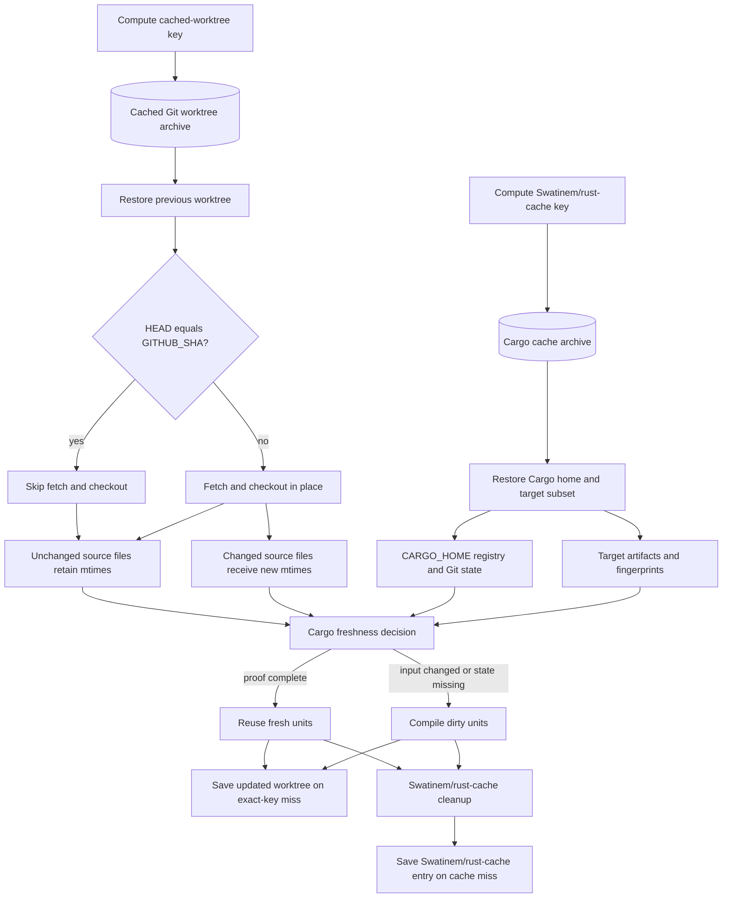

# `Swatinem/rust-cache` With Mtime-Preserving Checkout

## Summary

| Field | Value |
| --- | --- |
| Status | Recommended Cargo cache default |
| Use when | You want maintained, simple CI that can produce warm Cargo no-op builds. |
| Main tradeoff | Affected local path workspace members can still rebuild on exact target-cache hits. |

## Related Files

| File | Purpose |
| --- | --- |
| [Workflow example](../../examples/workflows/rust-cache-mtime-checkout.yml) | End-to-end workflow using a cached worktree with `Swatinem/rust-cache`. |
| [Cached worktree action](../../examples/actions/cached-worktree-checkout/action.yml) | Composite action that checks out into a restored worktree without rewriting unchanged file mtimes. |

## Design

```text
actions/cache restores cached worktree
custom checkout checks out source in place and preserves unchanged mtimes
Swatinem/rust-cache restores Cargo home and target state
Cargo builds with explicit CARGO_TARGET_DIR
```

## Architecture

The source-worktree cache and `Swatinem/rust-cache` preserve different inputs to Cargo's freshness decision:



The cached worktree prevents unchanged source files from appearing newer than restored outputs. `Swatinem/rust-cache` independently restores Cargo home and a dependency-oriented target subset. Both are needed for this approach: stable source mtimes do not replace target fingerprints, and restored target state does not help if checkout rewrites every source mtime.

For the selected RunsOn Magic Cache/S3 deployment, see the [RunsOn guide](../deployments/runs-on/README.md). This page keeps the approach itself provider-neutral.

## Why It Works

Normal checkout rewrites source mtimes. Cargo can treat rewritten source files as newer than restored target fingerprints, so local workspace crates rebuild even if contents are unchanged.

The cached worktree checkout avoids that false invalidation:

- If the worktree is already at `GITHUB_SHA`, it skips checkout entirely.
- If the worktree is older, Git checks out the new commit in place.
- Git rewrites changed files only, so unchanged files keep stable mtimes.

`Swatinem/rust-cache` then handles Cargo home and dependency-oriented target state.

## Recommended Settings

```yaml
- uses: Swatinem/rust-cache@v2
  with:
    workspaces: ./app -> ../../target-for-job
    cache-targets: true
    cache-workspace-crates: true
    shared-key: app-target-v1
```

These settings control different parts of the action's restore and cleanup behavior. See [`Swatinem/rust-cache` Behavior](../concepts/rust-cache-behavior.md) for exact true/false behavior, workspace/path-dependency examples, cleanup details, and upstream source links.

- `cache-targets: true` includes the configured target directory; this is the upstream default and is explicit here because target state is part of the approach.
- `cache-workspace-crates: true` retains matching target artifacts for Cargo workspace members, including libraries declared as workspace members.
- Leave `cache-all-crates` at its `false` default unless another step downloads registry crates outside the current dependency graph, such as a tool built through `cargo install` or an install action's source-build fallback.
- Keep the `cache-bin: true` default when another step installs Cargo-registered binaries. Set it to `false` when the workflow has none.

The options still do not produce a complete target snapshot, and exact cache hits are not replaced in the post step.

Use a stable explicit target directory:

```yaml
env:
  CARGO_TARGET_DIR: /tmp/cargo-target-one-job
```

## Strengths

- Maintained upstream cache action.
- Minimal custom logic.
- Fixes the biggest false rebuild source: source mtime churn.
- Can produce warm Cargo no-op builds.
- Avoids network filesystem metadata latency.
- Good repeated-run performance for most jobs.

## Limitations

- `rust-cache` target keys intentionally do not include workspace source contents.
- Exact cache hits can restore stale workspace artifacts and then skip saving rebuilt target state.
- Affected local path workspace members can therefore rebuild repeatedly in some jobs.

## Related Alternatives

Related source-mtime approaches, Retimer evidence, and Cargo checksum-freshness notes are preserved in [Source Mtime Alternatives](../reference/source-mtime-alternatives.md). They mainly address checkout mtime churn; they do not fix `rust-cache` exact-hit behavior where stale workspace target state is restored and not saved because the target key ignores workspace source contents.

## Evidence

The [cached worktree and source-keyed target-cache evidence](../evidence/cached-worktree-and-target-cache.md) records the normal-checkout failure, the warm Cargo no-op result after stabilizing source mtimes, the remaining local path workspace-member outliers in generated-code/build-script jobs, and the measured workaround results.

## Decision

Use this as the default for most Rust GitHub Actions CI workflows where:

- You want maintained upstream behavior.
- You do not have costly repeated rebuilds from affected local path workspace members.
- You value simplicity over custom target-cache composition.
