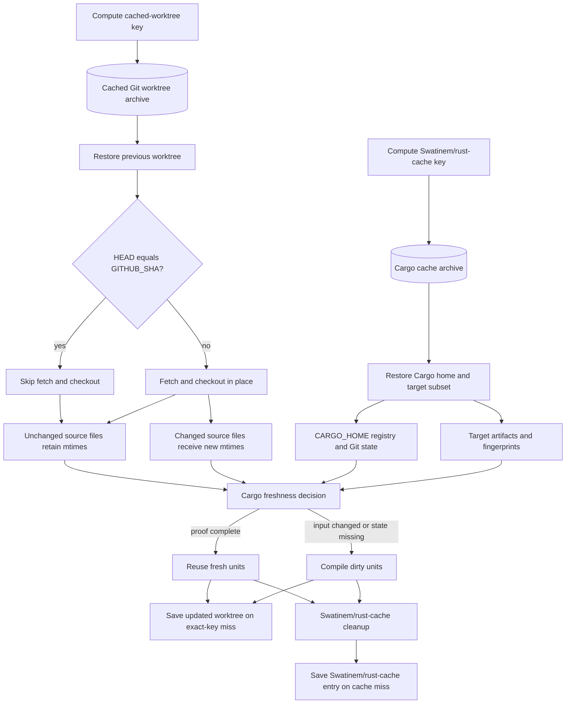

# `Swatinem/rust-cache` With Mtime-Preserving Checkout

This is the recommended default approach.

## Related Files

| File | Purpose |
| --- | --- |
| [Workflow example](../../examples/workflows/rust-cache-mtime-checkout.yml) | End-to-end cached worktree plus `Swatinem/rust-cache` workflow. |
| [Cached worktree action](../../examples/actions/cached-worktree-checkout/action.yml) | Composite action that checks out into a restored worktree without rewriting unchanged file mtimes. |

## Design

```text
actions/cache restores cached worktree
custom checkout checks out source in place and preserves unchanged mtimes
Swatinem/rust-cache restores Cargo home and target state
Cargo builds with explicit CARGO_TARGET_DIR
```

## Architecture

The source-worktree cache and `Swatinem/rust-cache` preserve different inputs
to Cargo's freshness decision:



The cached worktree prevents unchanged source files from appearing newer than
restored outputs. `Swatinem/rust-cache` independently restores Cargo home and
a dependency-oriented target subset. Both are needed for this approach:
stable source mtimes do not replace target fingerprints, and restored target
state does not help if checkout rewrites every source mtime.

For the selected RunsOn Magic Cache/S3 deployment, see the
[RunsOn guide](../runs-on/README.md). This page keeps the approach
itself provider-neutral.

## Why It Works

Normal checkout rewrites source mtimes. Cargo can treat rewritten source files as newer than restored target fingerprints, so local workspace crates rebuild even if contents are unchanged.

The cached worktree checkout avoids that false invalidation:

- If the worktree is already at `GITHUB_SHA`, it skips checkout entirely.
- If the worktree is older, Git checks out the new commit in place.
- Git rewrites changed files only, so unchanged files keep stable mtimes.

`Swatinem/rust-cache` then handles Cargo home and dependency-oriented target state.

## Recommended Settings

```yaml
- uses: Swatinem/rust-cache@v2
  with:
    workspaces: ./app -> ../../target-for-job
    cache-targets: true
    cache-workspace-crates: true
    shared-key: app-target-v1
```

These settings control different parts of the action's restore and cleanup
behavior. See
[`Swatinem/rust-cache` Behavior](../concepts/rust-cache-behavior.md) for exact
true/false behavior, workspace/path-dependency examples, cleanup details, and
upstream source links.

- Leave `cache-all-crates` at its `false` default unless another step downloads
  registry crates outside the current dependency graph, such as a tool built
  through `cargo install` or an install action's source-build fallback.
- Set `cache-bin` according to whether the workflow has Cargo-registered
  installed binaries to preserve.
- `cache-targets: true` includes the configured target directory; this is the
  upstream default and is explicit here because target state is part of the
  approach.
- `cache-workspace-crates: true` retains matching target artifacts for Cargo
  workspace members, including normal in-tree path crates.

The options still do not produce a complete target snapshot, and exact cache
hits are not replaced in the post step.

Use a stable explicit target directory:

```yaml
env:
  CARGO_TARGET_DIR: /tmp/cargo-target-one-job
```

## Strengths

- Maintained upstream cache action.
- Minimal custom logic.
- Fixes the biggest false rebuild source: source mtime churn.
- Avoids network filesystem metadata latency.
- Good repeated-run performance for most jobs.

## Limitations

- `rust-cache` target keys intentionally do not include workspace source contents.
- Exact cache hits can restore stale workspace artifacts and then skip saving rebuilt target state.
- Build-script/generated-code workspace crates can rebuild repeatedly in some jobs.

## Related Alternatives And Upstream Work

These approaches address the same source-mtime class of problem, but they are not equivalent to the source-keyed target-cache workaround.

| Approach | What it does | Notes |
| --- | --- | --- |
| [`chetan/git-restore-mtime-action`](https://github.com/chetan/git-restore-mtime-action) | Rewrites checked-out file mtimes from Git history, usually requiring `fetch-depth: 0`. | Can reduce false rebuilds from checkout mtime churn, but uses synthetic commit-time mtimes rather than preserving the previous CI worktree's mtimes. |
| [Retimer-style cached mtime state](https://gist.github.com/tmm1/0ec42a8a12bf78ece7a43ec6204cbdc3) | Saves prior source mtimes and restores them before running Cargo when file contents still match. | Closer to the cached-worktree idea, but adds another state file/cache to maintain and did not eliminate every rebuild in the linked report. |
| [Cargo checksum freshness](https://doc.rust-lang.org/nightly/cargo/reference/unstable.html#checksum-freshness) | Nightly Cargo's `-Z checksum-freshness` replaces file mtimes in Cargo fingerprints with checksums. | Promising for CI source checkout churn, but still unstable; build-script-ingested files continue to use mtimes. |

These alternatives mainly target source mtime churn. They do not fix `rust-cache` exact-hit behavior where stale workspace target state is restored and not saved again because the target cache key ignores workspace source contents.

### Retimer Primary Report

In a [June 29, 2025 comment on `Swatinem/rust-cache#155`](https://github.com/Swatinem/rust-cache/issues/155#issuecomment-3016173641),
`tmm1` showed a workflow that cached `target/` and `.retimer-state`, restored
matching source mtimes before `cargo build`, and saved them afterward. The
workflow was intended to correct source-mtime invalidation but did not make the
final crate fresh:

> However, I still observe the final project is always rebuilt (90s+ in my case), even if none of the code has changed.

Cargo reported the remaining rebuild as `stale, unknown reason`.

The linked
[`retimer.sh` revision](https://gist.github.com/tmm1/0ec42a8a12bf78ece7a43ec6204cbdc3/272b22ecbd6d65971d7cc0b3667ce4f6794c0516)
stores each Rust source path, SHA-256 digest, and mtime in `.retimer-state`.
During restore, it reapplies an mtime only when the current file hash still
matches. Its intended sequence is:

```text
restore .retimer-state and target from cache
retimer restore
cargo build
retimer save
save .retimer-state and target for the next run
```

This is useful evidence that correcting source mtimes can remove one class of
false invalidation without proving that the entire restored Cargo state is
fresh. The script tracks `*.rs` files outside `target/`; Cargo freshness can
also depend on manifests, configuration, generated inputs, build-script state,
dep-info, fingerprints, paths, toolchain, flags, and environment.

### Cargo Checksum Freshness

The official
[Cargo nightly documentation](https://doc.rust-lang.org/nightly/cargo/reference/unstable.html#checksum-freshness)
describes `-Z checksum-freshness` as replacing file mtimes in Cargo
fingerprints with file checksum values. It is explicitly intended for
environments with poor mtime behavior and for CI/CD.

```bash
cargo +nightly -Z checksum-freshness build --locked
```

This directly addresses source files receiving new mtimes during checkout, but
it is not yet a drop-in stable replacement for the approaches in this archive:

- It requires nightly Cargo and an unstable `-Z` flag.
- The checksum algorithm may change without notice between Cargo versions, so
  restored fingerprints should use the same Cargo version.
- Files consumed by build scripts continue to use mtimes for now.
- It changes freshness detection; it does not restore missing artifacts,
  dep-info, fingerprints, build-script outputs, or other cache state.
- It does not change `rust-cache` target-key or exact-hit save behavior.

Follow the official
[tracking issue `cargo#14136`](https://github.com/rust-lang/cargo/issues/14136)
for stabilization and build-script coverage. The original implementation is
[`cargo#14137`](https://github.com/rust-lang/cargo/pull/14137).

## Observed Result

Repeated same-SHA workflows with this approach produced most matrix jobs around 33 to 37 seconds. A few jobs with generated-code/build-script dependency chains were slower, around 50 to 65 seconds.

## When To Use

Use this as the default for most Rust GitHub Actions CI workflows where:

- You want maintained upstream behavior.
- You can tolerate occasional generated-code/build-script outliers.
- You value simplicity over maximum theoretical Cargo no-op fidelity.
