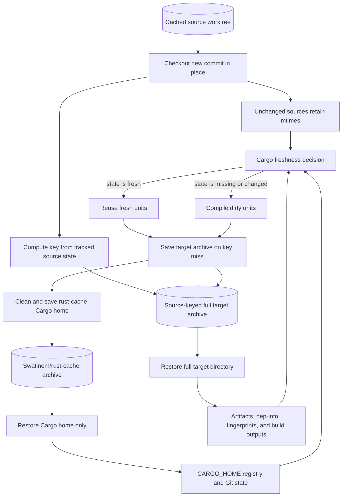

# `Swatinem/rust-cache` Plus Source-Keyed Target Cache

This is a proven workaround for true Cargo no-op behavior across all tested matrix jobs. It is not the recommended default unless the extra workflow complexity is justified.

## Related Files

| File | Purpose |
| --- | --- |
| [Workflow example](../../examples/workflows/rust-cache-source-keyed-target-cache.yml) | Splits Cargo home and source-keyed target caching with the required restore ordering. |

## Problem It Solves

`Swatinem/rust-cache` target caching can restore an exact cache key even when local workspace source has changed, because its target cache key focuses on Rust/Cargo environment, lockfiles, manifests, and config. With `cache-workspace-crates: true`, this can still leave a stale exact target cache for some workspace artifacts.

When the restored key is exact, `rust-cache` reports `Cache up-to-date` in its post step and does not save the rebuilt target state. The next run can restore the same stale target state and rebuild the same local crates again.

## Design

```text
cached worktree checkout preserves unchanged source mtimes
Swatinem/rust-cache restores Cargo home only with cache-targets: false
actions/cache restores full target directory after rust-cache
target cache key includes source state
Cargo builds with explicit CARGO_TARGET_DIR
```

## Architecture



The full target archive restores after `rust-cache`, so `rust-cache` cannot
prune workspace artifacts from it before the build. Its key includes source
state, allowing a changed source tree to seed a new target archive instead of
reusing an immutable stale exact hit indefinitely.

## Critical Ordering

The target cache must restore after `rust-cache`.

Correct:

```text
restore source worktree
setup Cargo registry credentials
setup toolchain
rust-cache restore Cargo home only
restore full target directory with actions/cache
build
actions/cache saves target directory
rust-cache post cleanup runs after target cache save
```

Incorrect:

```text
restore target directory with actions/cache
rust-cache restore
build
```

The incorrect ordering allowed `rust-cache` target cleanup to remove workspace target artifacts before they could prove Cargo units fresh.

## Key Strategy

The final workaround used a fast Git source key:

```bash
hash="$({ git rev-parse HEAD:app; git ls-files -s app; } | sha256sum | cut -d ' ' -f1)"
```

Tradeoff:

- Any tracked change under `app` invalidates all per-job target caches for that source hash.
- The computation is fast and simple.
- Restore prefixes still allow each job to restore its previous target cache as a starting point.

An intermediate dependency-closure key using `cargo metadata` was more precise, but it added about a minute per job in CI and was too expensive.

The repeated outliers this fixed were generated-code/build-script chains. Tight `cargo:rerun-if-changed` hints are still good build-script hygiene, but they do not fix stale exact target-cache restores when the target cache key ignores workspace source state.

## Verified Results

Previously slow generated-code/build-script dependency chains became no-op:

| Job type | Target cache | Cargo result |
| --- | --- | --- |
| Message API style job | source-keyed target cache hit | `Finished ... in 0.26s`, no `Compiling` lines. |
| Provider API style job | source-keyed target cache hit | `Finished ... in 0.24s`, no `Compiling` lines. |
| Provider callback style job | source-keyed target cache hit | `Finished ... in 0.31s`, no `Compiling` lines. |

## Why It Is Not The Default

The workaround adds custom cache composition and ordering constraints. It is correct and proven, but it is more workflow logic to own.

Use it if:

- Generated-code/build-script rebuilds are too expensive.
- A fork/adapter is warranted because upstream does not support the use case.

Retire or simplify this workaround if upstream `rust-cache` adds equivalent
source-keyed target caching.
