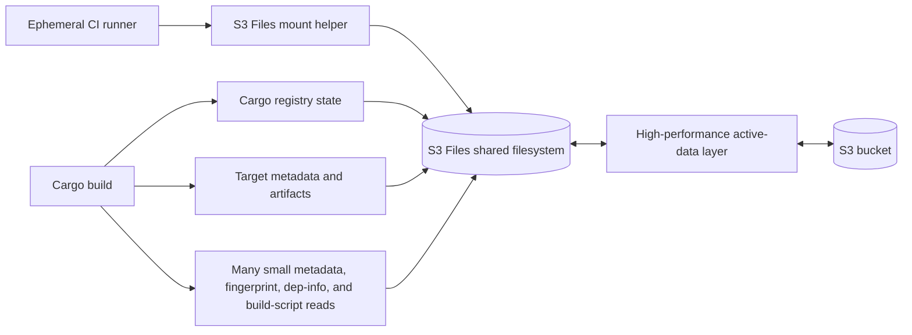

# S3 Files For Cargo Target State

## Summary

| Field | Value |
| --- | --- |
| Status | Rejected for Cargo target and registry no-op state |
| Use when | Another workload needs a shared filesystem across ephemeral workers. |
| Main tradeoff | Remote metadata and read behavior dominated the recorded Cargo no-op builds. |

## Related Files

| File | Purpose |
| --- | --- |
| [Workflow example](../../examples/workflows/s3-files-cargo-target.yml) | Generic S3 Files target-cache experiment shape. |
| [S3 Files mount action](../../examples/actions/s3-files-mount/action.yml) | Composite action for installing the S3 Files mount helper and mounting a file system. |

## Goal

The goal was to test whether an S3-backed shared filesystem could preserve or share enough Cargo state to make repeated Cargo builds fast across ephemeral workers.

## Architecture



S3 Files can preserve a shared namespace and make Cargo logically fresh, but Cargo still traverses many small files through the network filesystem. In the recorded experiments, that metadata/read path dominated the no-op build even when compilation itself was unnecessary.

## Current AWS Mechanics

Current AWS documentation describes S3 Files as a service that makes S3 buckets accessible as high-performance file systems powered by EFS. On EC2, the S3 Files client installs a mount helper that defines the Linux filesystem type `s3files`, compatible with the standard `mount` command.

Important mount facts:

- The EC2 instance must be in the same Availability Zone as the S3 Files mount target.
- The instance needs an IAM instance profile with S3 Files permissions and security groups that allow the mount path.
- The client is installed through `amazon-efs-utils`.
- The mount helper retrieves IAM credentials, starts TLS support/watchdog processes, and mounts with required `tls` and `iam` options.
- The AWS CLI exposes an `s3files` command group for file systems, access points, mount targets, synchronization configuration, and tags.

Minimal mount shape:

```bash
sudo mkdir /mnt/s3files
sudo mount -t s3files "$S3_FILES_FILE_SYSTEM_ID:/" /mnt/s3files
findmnt -T /mnt/s3files
```

References:

- [Mounting S3 file systems on Amazon EC2](https://docs.aws.amazon.com/AmazonS3/latest/userguide/s3-files-mounting.html)
- [AWS CLI `s3files` command reference](https://docs.aws.amazon.com/cli/latest/reference/s3files/)
- [S3 Files announcement](https://aws.amazon.com/about-aws/whats-new/2026/04/amazon-s3-files/)

## Strengths

- Presents a shared filesystem namespace to ephemeral workers.
- Can preserve enough state for Cargo to determine that no units need compilation.
- May remain useful for non-Cargo workloads that benefit from shared file access.

## Limitations

- Cargo still traverses many small metadata and artifact files remotely.
- Prewarming and priming can move cost without reducing total elapsed work.
- Mount helper installation and mount setup add job overhead.
- Import thresholds must account for large Rust artifacts.

## Evidence

The [S3 Files evidence record](../evidence/s3-files.md) contains the tested layouts, logical-freshness observation, measured timings, mount/setup costs, artifact-threshold finding, interpretation, and limitations.

## Decision

Do not use S3 Files for Cargo target or registry state in this workflow. It may still be useful for other shared filesystem workloads.
