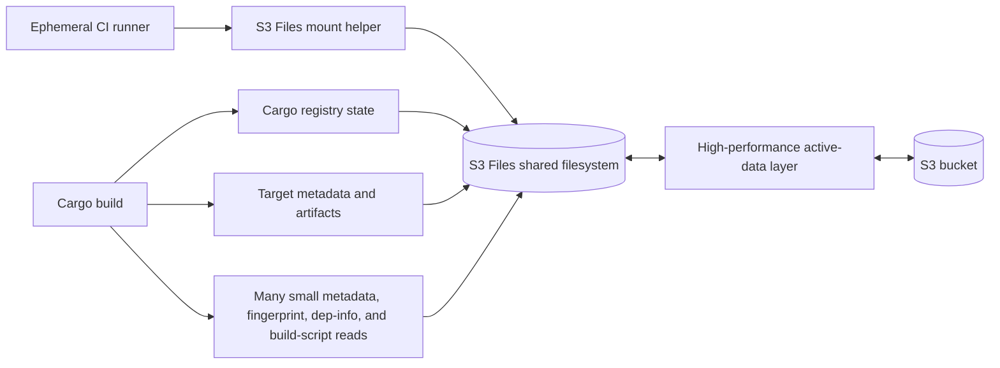

# S3 Files For Cargo Target State

S3 Files was tested as a shared filesystem for Cargo target and registry state. It was rejected for Cargo target no-op caching in these experiments.

## Related Files

| File | Purpose |
| --- | --- |
| [Workflow example](../../examples/workflows/s3-files-cargo-target.yml) | Generic S3 Files target-cache experiment shape. |
| [S3 Files mount action](../../examples/actions/s3-files-mount/action.yml) | Composite action for installing the S3 Files mount helper and mounting a file system. |

## Goal

The goal was to test whether an S3-backed shared filesystem could preserve or share enough Cargo state to make repeated Cargo builds fast across ephemeral workers.

## Architecture



S3 Files can preserve a shared namespace and make Cargo logically fresh, but
Cargo still traverses many small files through the network filesystem. In the
recorded experiments, that metadata/read path dominated the no-op build even
when compilation itself was unnecessary.

## Current AWS Mechanics

Current AWS documentation describes S3 Files as a service that makes S3 buckets accessible as high-performance file systems powered by EFS. On EC2, the S3 Files client installs a mount helper that defines the Linux filesystem type `s3files`, compatible with the standard `mount` command.

Important mount facts:

- The EC2 instance must be in the same Availability Zone as the S3 Files mount target.
- The instance needs an IAM instance profile with S3 Files permissions and security groups that allow the mount path.
- The client is installed through `amazon-efs-utils`.
- The mount helper retrieves IAM credentials, starts TLS support/watchdog processes, and mounts with required `tls` and `iam` options.
- The AWS CLI exposes an `s3files` command group for file systems, access points, mount targets, synchronization configuration, and tags.

Minimal mount shape:

```bash
sudo mkdir /mnt/s3files
sudo mount -t s3files "$S3_FILES_FILE_SYSTEM_ID:/" /mnt/s3files
findmnt -T /mnt/s3files
```

References:

- [Mounting S3 file systems on Amazon EC2](https://docs.aws.amazon.com/AmazonS3/latest/userguide/s3-files-mounting.html)
- [AWS CLI `s3files` command reference](https://docs.aws.amazon.com/cli/latest/reference/s3files/)
- [S3 Files announcement](https://aws.amazon.com/about-aws/whats-new/2026/04/amazon-s3-files/)

## Tested Shapes

- Cargo target directory on S3 Files.
- Cargo registry on S3 Files.
- Cargo target and registry both on S3 Files.
- S3 Files target with `Swatinem/rust-cache` handling Cargo registry/home.
- Prewarming S3 Files paths before the Cargo build.
- Copying registry state from S3 Files to local disk.
- Raising S3 Files import thresholds to include larger Rust artifacts.

## Important Cargo Observation

Cargo could be logically clean on S3 Files:

```text
Compiling 0
Downloaded 0
Dirty 0
fingerprint error 0
```

This means Cargo's freshness proof could succeed. The remaining issue was often the cost of reading/traversing metadata and fingerprint state on S3 Files.

## Representative Results

| Configuration | Observed result |
| --- | --- |
| Pure S3 Files registry + target | Forced no-op around 35 to 39 seconds. |
| S3 Files prewarm | Moved work earlier; did not remove total cost. Example prewarm around 41 seconds followed by lower Cargo time. |
| Copy registry from S3 Files to local disk | Not viable; one copy path took about 932 seconds. |
| `rust-cache` registry + S3 Files target | Cargo improved to around 8 to 14 seconds in some runs, but still did not beat local target cache behavior. |
| Target-directory priming after mount | Helped the Cargo step but mostly moved cost into the prime step. |

## Large Artifact Threshold Finding

The S3 Files import threshold needed to include large Rust artifacts. A 10 MiB threshold was too low.

Examples of large local target files:

```text
large SDK rlib                  84.00 MiB
large events rlib               48.16 MiB
Lambda bootstrap                14.13 MiB
```

The test sync config was raised to 1 GiB for relevant target paths.

## Mount/Setup Cost

The S3 Files mount path had non-trivial setup cost in the runner image used during testing:

- Total mount step was around 8 seconds.
- Actual `mount` plus `findmnt` was around 1.5 seconds.
- Installing/upgrading cached S3 Files helper packages cost about 5 to 6 seconds.

## Final Decision

Do not use S3 Files for Cargo target or registry state in this workflow. It may still be useful for other shared filesystem workloads.
