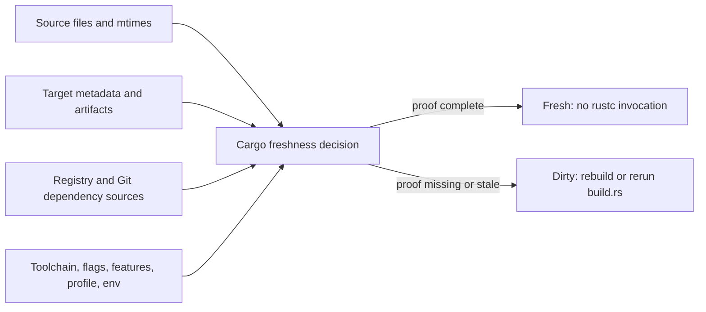

# Cargo Freshness Model

This page explains the short model behind every cache approach in this archive.

Cargo does not only check whether compiled files exist. It decides whether each build unit is fresh by combining source inputs, filesystem metadata, target metadata, dep-info files, fingerprints, build-script outputs, dependency sources, and build context.

The useful mental model: Cargo needs proof that every input to a unit is no newer or different than the output and fingerprint metadata for that unit.

If the proof is present and consistent, Cargo can report `Fresh`. If the proof is missing or inconsistent, Cargo marks the unit dirty and may invoke `rustc` or rerun a build script.

## What Must Stay Consistent

| Area | Why it matters |
| --- | --- |
| Source contents and mtimes | Unchanged source files must not look newer than restored outputs. |
| Workspace path | Dep-info and some metadata can reference absolute paths. |
| Target artifacts, dep-info, fingerprints, and build-script state | Cargo needs internal state, not just final binaries. |
| Registry and Git dependency source paths | Re-extracted sources can have different mtimes and paths. |
| Toolchain, profile, features, flags, config, and relevant env | Cargo and rustc fingerprint the build context. |

These are the core reasons normal checkout mtime churn can cause false rebuilds and why a target cache that keeps only final outputs is not enough.

## Why Local No-Op Builds Are Fast

Local no-op builds are fast because the source tree, source mtimes, target directory, fingerprints, dep-info files, build-script outputs, registry source paths, toolchain, flags, environment, profile, and features all remain mutually consistent.

When Cargo can prove each unit is fresh, it does not invoke rustc.

## Where To Go Next

| Need | Page |
| --- | --- |
| Full signal table and examples | [Cargo Freshness Signals](../reference/cargo-freshness-signals.md) |
| Which paths each cache approach covers | [Cargo Path Coverage](cargo-path-coverage.md) |
| `Swatinem/rust-cache` restore/save behavior | [`Swatinem/rust-cache` Behavior](rust-cache-behavior.md) |
| Debugging a build that still recompiles | [Diagnosing Cargo Rebuilds In CI](../operations/diagnosing-rebuilds.md) |
