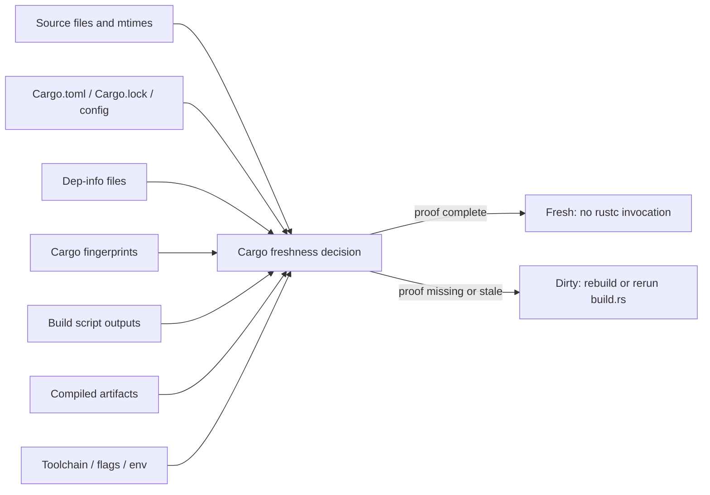

# Cargo Freshness Model

Cargo does not only look for compiled files. It decides whether every build unit is fresh by combining source inputs, target metadata, dep-info files, fingerprints, build-script outputs, registry sources, and environment/toolchain context.

The useful mental model is:

```text
Cargo needs proof that every input to a unit is no newer or different than the output and fingerprint metadata for that unit.
```



If the proof is present and consistent, Cargo can report `Fresh`. If the proof is missing or inconsistent, Cargo marks the unit dirty and may invoke `rustc` or rerun a build script.

## Freshness Signals

### Role Legend

| Icon | Role                          | Meaning                                                                                                                              |
| ---- | ----------------------------- | ------------------------------------------------------------------------------------------------------------------------------------ |
| 🎯   | Direct freshness determinant  | Directly participates in proving a unit is fresh or dirty. Missing/stale state commonly causes recompilation or build-script reruns. |
| 🧭   | Build-plan/config determinant | Changes the build graph, profile, target, features, toolchain, flags, or environment that Cargo/rustc fingerprints.                  |
| 📚   | Source input                  | Source material compiled by rustc or consumed by build scripts. Its path/content/mtime can affect freshness.                         |
| ⚡   | Dirty rebuild accelerator     | Does not decide whether a unit is fresh, but speeds up recompilation after Cargo decides a unit is dirty.                            |
| 📦   | Supporting cache/setup state  | Avoids downloads or setup work, but does not by itself prove Cargo units are fresh.                                                  |

### Signal Table

| Cargo signal                   | Role | Where it lives                                                                         | Cargo uses it for                                                    | If preserved                                                   | If missing/stale                                               |
| ------------------------------ | ---- | -------------------------------------------------------------------------------------- | -------------------------------------------------------------------- | -------------------------------------------------------------- | -------------------------------------------------------------- |
| Source file contents           | 📚   | `<workspace>/**/src/*.rs`, generated source files                                      | Primary compiler inputs                                              | Cargo can compare source state against target metadata         | Rebuild affected units                                         |
| Source file mtimes             | 🎯   | Filesystem metadata on source files                                                    | Mtime-based freshness and build-script rerun checks                  | Unchanged files remain provably older than outputs             | Cargo may see sources as newer and mark units dirty            |
| Manifest files                 | 🧭   | `Cargo.toml`                                                                           | Package graph, targets, dependencies, features                       | Dependency graph is stable                                     | Re-resolve/rebuild affected graph                              |
| Lockfile                       | 🧭   | `Cargo.lock`                                                                           | Exact dependency versions                                            | Dependency artifact reuse remains valid                        | Dependency set may change; many units can rebuild              |
| Cargo config                   | 🧭   | `.cargo/config.toml`, global Cargo config                                              | Registries, target config, rustflags, linker config                  | Build config stays compatible                                  | Changed flags/config can invalidate units                      |
| Absolute workspace path        | 🎯   | Build path such as `/mnt/build-snapshot/workspace/app`                                 | Dep-info paths are absolute by default; some metadata embeds paths   | Restored metadata points to valid files                        | Path mismatch can reduce usefulness of dep-info/fingerprints   |
| Registry crate archives        | 📦   | `$CARGO_HOME/registry/cache/**/*.crate`                                                | Reconstruct dependency source trees                                  | Avoids network downloads                                       | Cargo redownloads crates                                       |
| Registry source trees          | 📚   | `$CARGO_HOME/registry/src/**`                                                          | Dependency source inputs for rustc and dep-info                      | Dependency source mtimes/paths remain aligned                  | Cargo re-extracts sources; mtimes may change                   |
| Registry index/metadata        | 📦   | `$CARGO_HOME/registry/index/**`                                                        | Dependency resolution metadata                                       | Less registry update work                                      | Cargo refetches/reconstructs metadata                          |
| Git dependency DB              | 📦   | `$CARGO_HOME/git/db/**`                                                                | Bare repositories for git dependencies                               | Avoids git refetch                                             | Cargo refetches git dependencies                               |
| Git dependency checkouts       | 📚   | `$CARGO_HOME/git/checkouts/**`                                                         | Git dependency source inputs                                         | Source paths/mtimes remain stable                              | Cargo re-checks out sources; paths/mtimes can change           |
| Final artifacts                | 🎯   | `target/debug/<binary>`, `target/release/<binary>`, `target/<triple>/release/<binary>` | Final outputs and deployment inputs                                  | Relinking can be skipped if unit is fresh                      | Cargo rebuilds or relinks final output                         |
| Unit artifacts                 | 🎯   | `target/**/deps/*.rlib`, `*.rmeta`, proc-macro dylibs, object files                    | Downstream compilation and linking                                   | Downstream crates can stay fresh                               | Missing artifacts force rebuilds                               |
| Dep-info files                 | 🎯   | `target/**/deps/*.d`                                                                   | Input dependency tracking                                            | Cargo can prove which files affect each output                 | Missing dep-info causes dirty units/fingerprint errors         |
| Fingerprints                   | 🎯   | `target/**/.fingerprint/**`                                                            | Unit freshness metadata                                              | Cargo can report `Fresh` without invoking rustc                | Missing/different fingerprints cause dirty units               |
| Build script state             | 🎯   | `target/**/build/**`                                                                   | Build script executable, OUT_DIR, stdout metadata, rerun-if tracking | Build scripts can be skipped; generated/native outputs persist | Build scripts rerun; downstream units may rebuild              |
| Incremental state              | ⚡   | `target/**/incremental/**`                                                             | Faster recompilation of dirty units                                  | Dirty units recompile faster                                   | Fresh units can still be fresh, but dirty units rebuild slower |
| Toolchain version              | 🧭   | rustc/rustup toolchain, often under `RUSTUP_HOME`                                      | Compatibility of all compiled outputs                                | Artifacts remain compatible                                    | Toolchain mismatch invalidates artifacts                       |
| Build flags and env            | 🧭   | `RUSTFLAGS`, `CARGO_*`, `CC`, `CFLAGS`, target env, profile/features                   | Compiler invocation identity and build-script rerun behavior         | Fingerprints remain valid                                      | Units become dirty or build scripts rerun                      |
| Cargo-installed binaries/tools | 📦   | `$CARGO_HOME/bin`, `$CARGO_HOME/.crates.toml`, `$CARGO_HOME/.crates2.json`             | Build command availability for binaries installed into Cargo home    | Cargo-installed tool setup can be skipped                      | Tools reinstall if missing                                     |
| Cargo helper caches            | 📦   | `XDG_CACHE_HOME` or `$HOME/.cache`, for example `$XDG_CACHE_HOME/cargo-zigbuild`       | Cargo subcommand/helper wrapper state and generated helper files     | Helper setup/cache state is restored with the build filesystem | Helpers recreate cache state outside the restored filesystem    |
| Non-Cargo tool installs        | 📦   | runner tool cache, action-specific install dirs, custom tool dirs                      | Build command availability for setup-action tools                    | Setup actions can be no-ops if they use those paths            | Tools redownload/reinstall if missing                          |

The rows marked 🎯 and 🧭 are the most important for deciding whether Cargo can do a true no-op. Rows marked 📦 mostly reduce download/setup time, but they do not by themselves prove Cargo units are fresh. The incremental row is useful only after Cargo has already decided something is dirty.

Binaries installed with `cargo install` usually live in `$CARGO_HOME/bin`. Some of those binaries are named `cargo-*` and can be invoked as `cargo <name>`, but the cacheable location is still Cargo home. Rustup components are separate toolchain state. For example, `cargo fmt` is backed by the `rustfmt` Rustup component, so preserving it is toolchain/Rustup state rather than Cargo dependency state.

Some Cargo subcommands and Cargo-backed build frontends also write helper state outside `$CARGO_HOME` and `target/`. For example, `cargo-lambda` can use `cargo-zigbuild`, which writes linker wrapper/cache state under the platform cache directory, normally `$HOME/.cache/cargo-zigbuild` on Linux. If that state should be preserved by a snapshot, set `XDG_CACHE_HOME` to a directory under the snapshot root for the Cargo build step, such as `/mnt/build-snapshot/xdg-cache`. This is still Cargo-helper state, not the Zig compiler tarball or rustup toolchain cache.

## Where Cargo Stores Inter-Build State

These paths are the main "breadcrumbs" Cargo leaves behind for later builds.

### Workspace Tree

```text
<workspace>/Cargo.toml
<workspace>/Cargo.lock
<workspace>/.cargo/config.toml
<workspace>/**/src/**/*.rs
<workspace>/**/build.rs
generated source files
```

The workspace tree contains the source inputs and manifest/config inputs. Preserving it helps because unchanged files keep stable mtimes and paths.

### Cargo Home

```text
$CARGO_HOME/bin/
$CARGO_HOME/.crates.toml
$CARGO_HOME/.crates2.json
$CARGO_HOME/registry/index/
$CARGO_HOME/registry/cache/
$CARGO_HOME/registry/src/
$CARGO_HOME/git/db/
$CARGO_HOME/git/checkouts/
$CARGO_HOME/config.toml
$CARGO_HOME/credentials.toml
```

Cargo home contains download caches, extracted dependency sources, git dependency repositories/checkouts, installed binaries, config, and credentials.

`registry/src` is especially important for no-op reuse because dep-info files can reference dependency source paths and Cargo may use mtimes for freshness. Reconstructing it from `registry/cache` is correct, but not equivalent to preserving the previous filesystem state.

### Target Directory

```text
target/debug/
target/release/
target/<target-triple>/debug/
target/<target-triple>/release/
target/**/deps/
target/**/.fingerprint/
target/**/build/
target/**/incremental/
```

The target directory contains both final outputs and internal Cargo/rustc state. For no-op behavior, the internal state matters as much as final binaries.

### Cargo Helper Cache Directories

```text
$XDG_CACHE_HOME/cargo-zigbuild/
$HOME/.cache/cargo-zigbuild/     # default when XDG_CACHE_HOME is unset on Linux
```

These directories are not part of Cargo home or the target directory, but they can be written by Cargo subcommands or build frontends that participate in the build. If a workflow's goal is to snapshot Cargo-specific build state surgically, point `XDG_CACHE_HOME` at a directory under the snapshot root only for the relevant Cargo build step. Keep unrelated setup-action caches, tool archives, and compiler downloads on their normal cache backend unless they are deliberately part of the snapshot.

## Example Local Target Shape

### Target Directory Sizes

One local workspace build produced this rough shape:

```text
target/                       16G
target/debug/                 13G
target/debug/deps/           8.7G
target/debug/incremental/    3.2G
target/debug/build/          700M
target/debug/.fingerprint/    53M
```

### Cargo Home Sizes

The corresponding Cargo home shape was roughly:

```text
~/.cargo/registry             2.5G
~/.cargo/registry/cache       388M
~/.cargo/registry/src         2.0G
~/.cargo/git                  4K
~/.cargo/bin                  155M
```

This shows why preserving only final binaries is insufficient. A large amount of state lives in `deps/`, `incremental/`, `build/`, `.fingerprint/`, and extracted registry sources.

## Example Dep-info File

Simplified example:

```makefile
target/debug/deps/example_lib-<hash>.d: libs/example/src/lib.rs libs/example/src/module.rs

target/debug/deps/libexample_lib-<hash>.rlib: libs/example/src/lib.rs libs/example/src/module.rs

target/debug/deps/libexample_lib-<hash>.rmeta: libs/example/src/lib.rs libs/example/src/module.rs
```

Cargo/rustc use this kind of file to track what source inputs correspond to a produced artifact.

## Example Fingerprint Metadata

Simplified example:

```json
{
  "rustc": 17467972547956852243,
  "features": "[]",
  "target": 7560080362312294917,
  "profile": 6675295047989516842,
  "path": 14399096996600243147,
  "deps": [["...", "serde", false, "..."]],
  "local": [
    {
      "CheckDepInfo": {
        "dep_info": "debug/.fingerprint/example-lib/dep-lib-example",
        "checksum": false
      }
    }
  ],
  "rustflags": [],
  "config": 8247474407144887393,
  "compile_kind": 0
}
```

This demonstrates why missing fingerprints are so important. Cargo is not merely checking whether `libexample.rlib` exists. It is checking a structured record of rustc version, features, target, profile, dependencies, dep-info path, rustflags, config, and compile kind.

## Why Local No-Op Builds Are Fast

Local no-op builds are fast because all the signals above remain mutually consistent:

```text
same source tree
same source mtimes
same target directory
same fingerprints
same dep-info files
same build script outputs
same registry source paths
same toolchain
same flags/env/profile/features
```

When Cargo can prove each unit is fresh, it does not invoke rustc.

## Official Cargo References

- [Build cache](https://doc.rust-lang.org/cargo/reference/build-cache.html)
- [Cargo home](https://doc.rust-lang.org/cargo/guide/cargo-home.html)
- [Build scripts and change detection](https://doc.rust-lang.org/cargo/reference/build-scripts.html#change-detection)
- [Unstable checksum freshness](https://doc.rust-lang.org/nightly/cargo/reference/unstable.html#checksum-freshness)
- [Environment variables](https://doc.rust-lang.org/cargo/reference/environment-variables.html)
- [Profiles and incremental compilation](https://doc.rust-lang.org/cargo/reference/profiles.html#incremental)
