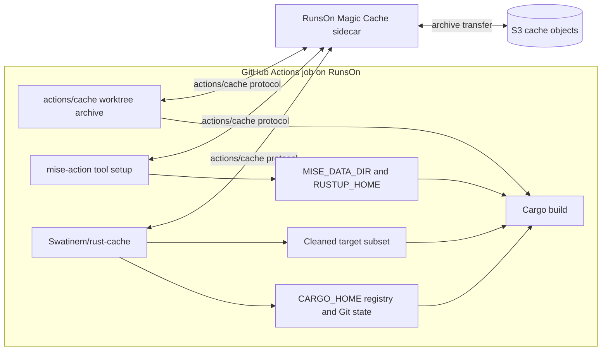
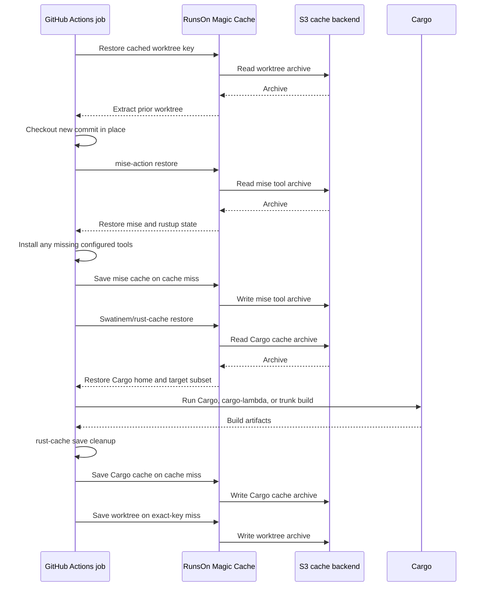

# RunsOn Magic Cache

This page maps the repository's recommended Cargo cache approach onto RunsOn. RunsOn Magic Cache supplies an S3-backed implementation of the `actions/cache` protocol; `Swatinem/rust-cache` still decides which Cargo paths are restored, cleaned, and saved.

## Documentation Ownership

This page owns the selected RunsOn deployment:

- Runner and Magic Cache setup.
- S3 backend boundaries.
- The combined worktree, mise, and `rust-cache` workflow shape.
- RunsOn-specific configuration and maintenance assumptions.

Other pages should link here instead of repeating that guidance. Generic Cargo approach selection stays in [`docs/approaches/`](../../approaches/README.md), tool-setup mechanics stay in [mise tool setup](../../operations/mise-tool-setup.md), `rust-cache` input semantics stay in [`rust-cache` behavior](../../concepts/rust-cache-behavior.md), measurements stay under [`docs/evidence/`](../../evidence/README.md), and archived snapshot or S3 Files implementations stay with their approach and action documentation.

## Selected Architecture

Use these layers together:

```text
RunsOn runner with Magic Cache / S3 backend
actions/cache for the mtime-preserving source worktree
mise-action for Rust, Zig, targets, and helper tools
Swatinem/rust-cache for Cargo home and target state
stable explicit CARGO_TARGET_DIR for the build
```

Do not add an EBS filesystem snapshot to this design. It is a separate archived approach with different restore and lifecycle semantics.

## Cache Ownership

Each layer owns a different kind of state:

| State | Owner | Why |
| --- | --- | --- |
| Source worktree and unchanged source mtimes | `actions/cache` plus the cached-worktree checkout | Prevents normal checkout from making unchanged source files appear newer than restored Cargo outputs. |
| Rust toolchain, rustup targets, Zig, and Cargo-distributed helper tools | `jdx/mise-action` | Mise installs and caches tools under `MISE_DATA_DIR`; these are setup state, not Cargo freshness state. |
| Cargo registry and Git dependency state | `Swatinem/rust-cache` | Keeps dependency downloads and sources aligned with the workspace dependency graph. |
| Dependency and workspace-library target state | `Swatinem/rust-cache` | Restores the target metadata and artifacts used by Cargo's freshness checks, subject to `rust-cache` cleanup. |
| Final build output location | Explicit stable `CARGO_TARGET_DIR` | Keeps restored target paths consistent between jobs. |

Keep these ownership boundaries strict. In particular, declare stable helper tools in mise instead of installing them separately with `cargo install`, and do not place `CARGO_HOME` under `MISE_DATA_DIR`.

## Backend Boundary



The S3 backend changes cache transport and storage. It does not change cache keys, archive extraction, `rust-cache` cleanup, or exact-hit save behavior.

## Job Sequence



## Recommended Configuration

RunsOn does not require different `mise-action` or `rust-cache` inputs. [Magic Cache](https://runs-on.com/docs/performance/caching/actions/) transparently replaces the `actions/cache` storage backend, while mise and `rust-cache` retain their normal path selection, keying, cleanup, and save behavior.

Use the canonical configuration from the generic pages rather than a RunsOn-specific copy:

- The mise tool block, environment variables, and reasoning are in [mise tool setup](../../operations/mise-tool-setup.md).
- The `rust-cache` input values and their reasoning are in [`rust-cache` behavior](../../concepts/rust-cache-behavior.md) and the [recommended approach](../../approaches/rust-cache-mtime-checkout.md).
- The complete combined workflow is in [`runs-on-mise-rust-cache.yml`](../../../examples/workflows/runs-on-mise-rust-cache.yml).

### RunsOn-Specific Deltas

These are the only choices that are specific to deploying on RunsOn rather than generic guidance:

| Concern | RunsOn choice | Reason |
| --- | --- | --- |
| Cache backend | Enable `extras=s3-cache` and run `runs-on/action@v2` before any cache step. | Magic Cache redirects the `actions/cache` protocol to the RunsOn S3 backend for the worktree, mise, and `rust-cache` entries. |
| `MISE_DATA_DIR` | Stable job-local path such as `${{ github.workspace }}/.mise`. | `mise-action` caches this directory through `actions/cache`, which Magic Cache backs with S3. |
| `RUSTUP_HOME` | Directory under `MISE_DATA_DIR`. | Keeps the rustup toolchain, components, and targets in the same S3-backed mise cache. |
| `CARGO_HOME` | Not under `MISE_DATA_DIR`. | Cargo home can hold registry credentials and is already owned and cleaned by `rust-cache`. |
| `CARGO_TARGET_DIR` | Explicit stable path. | Keeps restored target paths consistent between jobs on ephemeral runners. |

Keep the cache-ownership boundaries above strict: declare stable helper tools in mise instead of `cargo install`, and do not let `rust-cache` and mise both own `$CARGO_HOME/bin`.

These settings still use dependency-oriented `rust-cache` target cleanup rather than a complete target snapshot. If measurable generated-code or build-script outliers persist, use the [source-keyed full-target workaround](../../approaches/rust-cache-source-keyed-target-cache.md).

## Workflow Shape

Use the complete [RunsOn, mise, and `rust-cache` workflow](../../../examples/workflows/runs-on-mise-rust-cache.yml). Its required order is:

1. Enable `extras=s3-cache` and run `runs-on/action@v2`.
2. Restore and update the cached worktree.
3. Configure registry credentials when required.
4. Run `mise-action` so the build toolchain and helper tools are active.
5. Restore `rust-cache` using the explicit ownership settings from [`rust-cache` behavior](../../concepts/rust-cache-behavior.md).
6. Build with a stable explicit `CARGO_TARGET_DIR`.

## Tool Setup

Use `jdx/mise-action@v4` with inline `mise_toml` as the setup layer for Rust, targets, Zig, `cargo-binstall`, `cargo-lambda`, `trunk`, and similar tools. Its `actions/cache` integration uses the same Magic Cache backend as the worktree and Cargo caches.

Keep Cargo home separate from the mise cache, especially when registry credentials are written there. If source-keyed target caching is in use, bump its namespace after changing toolchain locations, targets, installer backends, wrappers, or build flags.

See [Mise Tool Setup](../../operations/mise-tool-setup.md) for the copyable configuration, environment variables, ordering, and target-key rules. The [`rust-cache` taiki-e explanation](../../concepts/rust-cache-behavior.md#tool-example-taiki-e-prebuilt-tools) remains useful when maintaining workflows that still use that installer.

## Maintenance

Before changing this platform shape, verify the current RunsOn runner-label syntax, Magic Cache setup, S3 backend behavior, and `runs-on/action` major. Keep those platform-specific assumptions on this page rather than copying them into generic Cargo approach pages.

## Related Pages

- [Decisions](../../decisions/README.md)
- [Recommended cache approach](../../approaches/rust-cache-mtime-checkout.md)
- [Mise tool setup](../../operations/mise-tool-setup.md)
- [Cache primitive boundaries](../../concepts/cache-primitives.md)
- [`rust-cache` vs EBS snapshot evidence](../../evidence/rust-cache-vs-snapshot.md)
- [Observed RunsOn cache object shape](../../evidence/rust-cache-vs-snapshot.md#magic-cache-object-shape)
