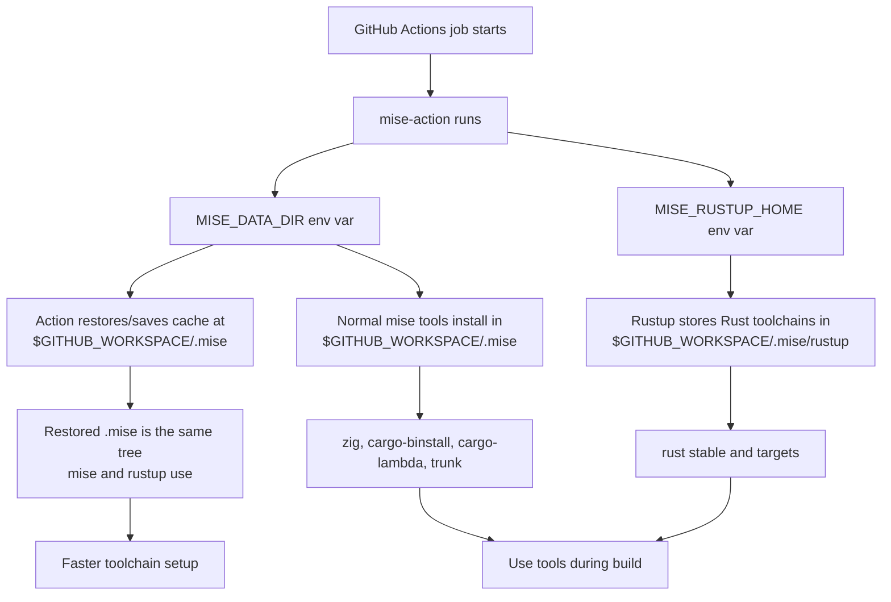

# Mise Tool Setup

Use `mise-action` as the preferred CI setup layer for Rust-adjacent tools and runtimes, especially on RunsOn runners with Magic Cache enabled.

This is not a Cargo cache approach. It is setup guidance that applies before the selected Cargo cache approach, such as `Swatinem/rust-cache` plus an mtime-preserving checkout or a source-keyed target cache. Let Cargo caches handle Cargo home and target freshness; let mise handle repeated tool installation.

## Why

`mise-action` uses `actions/cache` for its mise directory. If `mise_dir` is not set, the action falls back to `MISE_DATA_DIR`, then XDG/default home paths. Set `MISE_DATA_DIR` so both mise and the action use the same cached tree for normal tool installs. Put mise-managed Rust state under that tree with `MISE_RUSTUP_HOME`, because Rust is installed through rustup rather than mise's normal `installs/` directory.

With RunsOn Magic Cache backing `actions/cache`, repeated installs of Zig, Rust toolchains/targets, `cargo-binstall`, `cargo-lambda`, `trunk`, and similar setup tools become effectively free after the cache is warm.

This removes the need for several separate setup/install actions and avoids paying repeated setup time in every matrix job.

## Recommended Shape

Use inline `mise_toml` in the workflow when the tool set is CI-specific:

```yaml
env:
  MISE_DATA_DIR: ${{ github.workspace }}/.mise
  MISE_RUSTUP_HOME: ${{ github.workspace }}/.mise/rustup

steps:
  - name: Setup Toolchain
    uses: jdx/mise-action@v4
    with:
      cache: true
      mise_toml: |
        [tools]
        zig = "0.16.0"
        rust = { version = "stable", components = "rustfmt", targets = "aarch64-unknown-linux-gnu" }
        cargo-binstall = "latest"
        "cargo:cargo-lambda" = "latest"
```

For a Trunk/WebAssembly job:

```yaml
env:
  MISE_DATA_DIR: ${{ github.workspace }}/.mise
  MISE_RUSTUP_HOME: ${{ github.workspace }}/.mise/rustup

steps:
  - name: Setup Toolchain
    uses: jdx/mise-action@v4
    with:
      cache: true
      mise_toml: |
        [tools]
        rust = { version = "stable", components = "rustfmt", targets = "wasm32-unknown-unknown" }
        cargo-binstall = "latest"
        "cargo:trunk" = "latest"
```

Install `cargo-binstall` first so mise can use prebuilt binaries where available instead of compiling tool CLIs.

Prefer the mise Cargo backend for Cargo-distributed tools over the GitHub release backend:

- Use `"cargo:cargo-lambda"` for `cargo-lambda`.
- Use `"cargo:trunk"` for Trunk.

## Environment Variables

Required for warm setup caches:

```yaml
env:
  MISE_DATA_DIR: ${{ github.workspace }}/.mise
  MISE_RUSTUP_HOME: ${{ github.workspace }}/.mise/rustup

steps:
  - name: Setup Toolchain
    uses: jdx/mise-action@v4
    with:
      cache: true
```

`MISE_DATA_DIR` is the mise runtime data directory. Normal mise-managed tools and shims live there. `mise-action` also uses `MISE_DATA_DIR` as its cache path when `mise_dir` is not provided, so setting this one env var is usually enough.

`mise_dir` is still useful as an explicit override, but it is not required when `MISE_DATA_DIR` is already set. If both are used, they should point at the same path. Setting only `mise_dir` is not equivalent to setting `MISE_DATA_DIR`, because `mise-action` does not export `MISE_DATA_DIR` for mise.

`MISE_RUSTUP_HOME` keeps Rust toolchains and rustup targets under the same cached tree. This matters because mise manages Rust through rustup; Rust does not live under mise's normal `installs/` directory. The official mise Rust docs state that Rust respects `RUSTUP_HOME` and `CARGO_HOME`, and that `MISE_RUSTUP_HOME` and `MISE_CARGO_HOME` can isolate mise's rustup/cargo state from other installations.



Usually not required:

- `RUSTUP_HOME`: prefer `MISE_RUSTUP_HOME` when Rust is managed by mise, because it makes ownership explicit and avoids changing non-mise rustup behavior.
- `MISE_OVERRIDE_CONFIG_FILENAMES`: not set by `mise-action`, but generally unnecessary after `mise-action` exports the resolved environment for later steps.

Avoid:

- Do not set `CARGO_HOME` or `MISE_CARGO_HOME` under the mise cache when registry credentials are written there. Let `rust-cache` own Cargo home caching and credential-sensitive Cargo paths.

## Ordering

Run setup in this order:

1. Restore/check out the workspace using the repository's mtime-preserving strategy.
2. Configure private registry credentials such as Shipyard.
3. Run `mise-action` for toolchains and setup tools.
4. Restore `rust-cache` / target caches.
5. Run Cargo builds with explicit `CARGO_TARGET_DIR`.

`mise-action` should happen before `rust-cache` so `rust-cache` sees the Rust environment that the build will use.

## Target-Key Rule

Changing setup tooling can change Cargo's build semantics even when application source does not change. If using a source-keyed target cache, bump the target-key namespace after changing any of these:

- Rust home/toolchain location.
- Rust targets.
- Build flags such as `--locked` vs `--frozen`.
- Target triples.
- Profiles or features.
- Tool wrappers or setup backend, such as switching from `dtolnay/rust-toolchain` and installer actions to mise.

Example:

```yaml
target-key: mise-locked-v1-${{ steps.app-source-key.outputs.hash }}
```

The first run after a namespace bump should seed the new target cache. The immediate follow-up run is the one that should prove warm no-op behavior.

## What This Does Not Solve

Mise setup caching makes tool installation fast. It does not by itself prove Cargo units fresh. Cargo no-op behavior still depends on source mtimes, target fingerprints, dep-info files, build-script outputs, registry source paths, and consistent build semantics.

Keep using the selected Cargo cache approach, such as `Swatinem/rust-cache` plus mtime-preserving checkout, and use source-keyed target caches when workspace rebuild outliers justify them.
