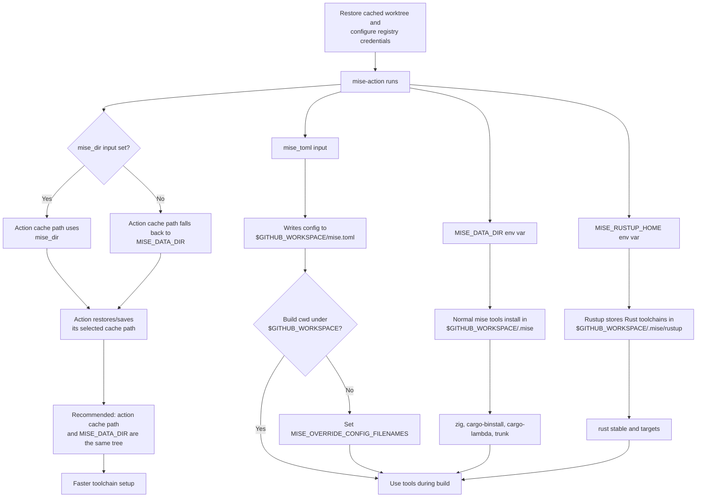

# Mise Tool Setup Details

This page preserves the detailed reasoning behind [Mise Tool Setup](../operations/mise-tool-setup.md). Use it when maintaining the workflow, debugging mise config discovery, or checking upstream implementation assumptions.

## Cache Path Behavior

`mise-action` uses `actions/cache` for its mise directory. If `mise_dir` is not set, the action falls back to `MISE_DATA_DIR`, then XDG/default home paths. Set `MISE_DATA_DIR` so both mise and the action use the same cached tree for normal tool installs. Put mise-managed Rust state under that tree with `MISE_RUSTUP_HOME`, because Rust is installed through rustup rather than mise's normal `installs/` directory.

With RunsOn Magic Cache backing `actions/cache`, repeated installs of Zig, Rust toolchains/targets, `cargo-binstall`, `cargo-lambda`, `trunk`, and similar setup tools become effectively free after the cache is warm.

`MISE_DATA_DIR` is the mise runtime data directory. Normal mise-managed tools and shims live there. `mise-action` also uses `MISE_DATA_DIR` as its cache path when `mise_dir` is not provided, so setting this one env var is usually enough.

`mise_dir` is still useful as an explicit override, but it is not required when `MISE_DATA_DIR` is already set. If both are used, they should point at the same path. Setting only `mise_dir` is not equivalent to setting `MISE_DATA_DIR`, because `mise-action` does not export `MISE_DATA_DIR` for mise.

`MISE_RUSTUP_HOME` keeps Rust toolchains and rustup targets under the same cached tree. This matters because mise manages Rust through rustup; Rust does not live under mise's normal `installs/` directory. The official mise Rust docs state that Rust respects `RUSTUP_HOME` and `CARGO_HOME`, and that `MISE_RUSTUP_HOME` and `MISE_CARGO_HOME` can isolate mise's rustup/cargo state from other installations.

## Inline Config Discovery

`MISE_OVERRIDE_CONFIG_FILENAMES` is required when `mise-action` uses inline `mise_toml` and later build steps run outside `$GITHUB_WORKSPACE`. The action writes inline `mise_toml` to `$GITHUB_WORKSPACE/mise.toml`; it does not write it to `mise_dir`, and `working_directory` does not change where the inline file is written. If the build runs from any worktree outside `$GITHUB_WORKSPACE`, mise's normal upward config search will not find `$GITHUB_WORKSPACE/mise.toml` unless this override is set.

If the build worktree is under `$GITHUB_WORKSPACE`, for example `$GITHUB_WORKSPACE/cached-worktree/app`, `MISE_OVERRIDE_CONFIG_FILENAMES` is not needed because mise can discover `$GITHUB_WORKSPACE/mise.toml` naturally. Prefer a descriptive directory name such as `cached-worktree` over `cached` because this workflow also caches mise data, Cargo target directories, and Rust/Cargo state.

A clear workspace layout is:

```yaml
env:
  CACHED_WORKTREE: ${{ github.workspace }}/cached-worktree
  CACHED_CARGO_TARGET_DIR: ${{ github.workspace }}/cached-cargo-target-job
  MISE_DATA_DIR: ${{ github.workspace }}/.mise
  MISE_RUSTUP_HOME: ${{ github.workspace }}/.mise/rustup
```

Keep Cargo target directories outside the checked-out workspace under `cached-worktree` so source checkout state and build output state remain separate, but keep them under `$GITHUB_WORKSPACE` so all restored/saved CI state is easy to inspect.

## Tool Version Notes

Install `cargo-binstall` first so mise can use prebuilt binaries where available instead of compiling tool CLIs.

Pin artifact build tools such as Zig, `cargo-lambda`, and Trunk. `latest` is convenient while experimenting, but a warm `mise-action` cache does not automatically invalidate when a new upstream Zig or Cargo tool release appears. The cache key includes the config text and restored cache path; if `zig = "latest"` previously resolved to `0.16.0`, repeated cached runs can continue using `0.16.0` until the cache key changes or the cache is refreshed. Pinning makes CI artifacts reproducible and makes version changes explicit. `cargo-binstall` is an installer mechanism for Cargo-backed tools, so using `latest` for it is acceptable.

Use `rust = "stable"` unless the repository declares a Rust version in `rust-toolchain.toml` or `workspace.package.rust-version`. This keeps app artifact builds aligned with normal Rust CI that also tracks stable. If the repository adopts a single checked-in Rust version, update the mise config to follow that source of truth.

Prefer the mise Cargo backend for Cargo-distributed tools over the GitHub release backend:

- Use `"cargo:cargo-lambda"` for `cargo-lambda`.
- Use `"cargo:trunk"` for Trunk.

## Historical Shim Failure

Do not use `depends = ["rust", "cargo-binstall"]` to compensate for hidden config discovery problems. With a selected `$GITHUB_WORKSPACE/cached-worktree/app` layout, mise can discover the inline `mise_toml` naturally and Cargo-backed setup tools such as `cargo-lambda` work without `depends`.

The historical `No version is set for shim: cargo-lambda` failure was not an install failure. `mise install` installed `cargo-lambda`, and `mise ls` showed it. The later build failed because the shim ran from a worktree outside `$GITHUB_WORKSPACE`, could not discover `$GITHUB_WORKSPACE/mise.toml`, and therefore had no active version.

Usually not required:

- `RUSTUP_HOME`: prefer `MISE_RUSTUP_HOME` when Rust is managed by mise, because it makes ownership explicit and avoids changing non-mise rustup behavior.
- `depends`: not required for Cargo-backed setup tools when the later build can discover the same mise config that `mise-action` used. It may still be useful for documenting install order, but it should not be used as the fix for config visibility.

Avoid:

- Do not set `CARGO_HOME` or `MISE_CARGO_HOME` under the mise cache when registry credentials are written there. Let `rust-cache` own Cargo home caching and credential-sensitive Cargo paths.

## Data Flow



## Official References

- [`mise-action` README and cache configuration](https://github.com/jdx/mise-action)
- [`mise-action` input definitions](https://github.com/jdx/mise-action/blob/main/action.yml)
- [Mise Cargo backend and `cargo-binstall` behavior](https://mise.jdx.dev/dev-tools/backends/cargo.html)
- [Mise tool dependency ordering](https://mise.jdx.dev/dev-tools/)
- [Cargo backend dependency declarations](https://github.com/jdx/mise/blob/40c2a2373c2f85f7f6cadfdfe377db9060686076/src/backend/cargo.rs#L103-L109)
- [Install dependency graph construction](https://github.com/jdx/mise/blob/40c2a2373c2f85f7f6cadfdfe377db9060686076/src/toolset/tool_deps.rs#L48-L66)
- [Open Rust cache interaction issue](https://github.com/jdx/mise-action/issues/215)

