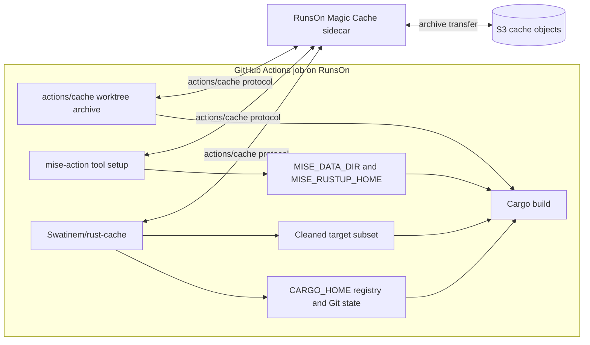
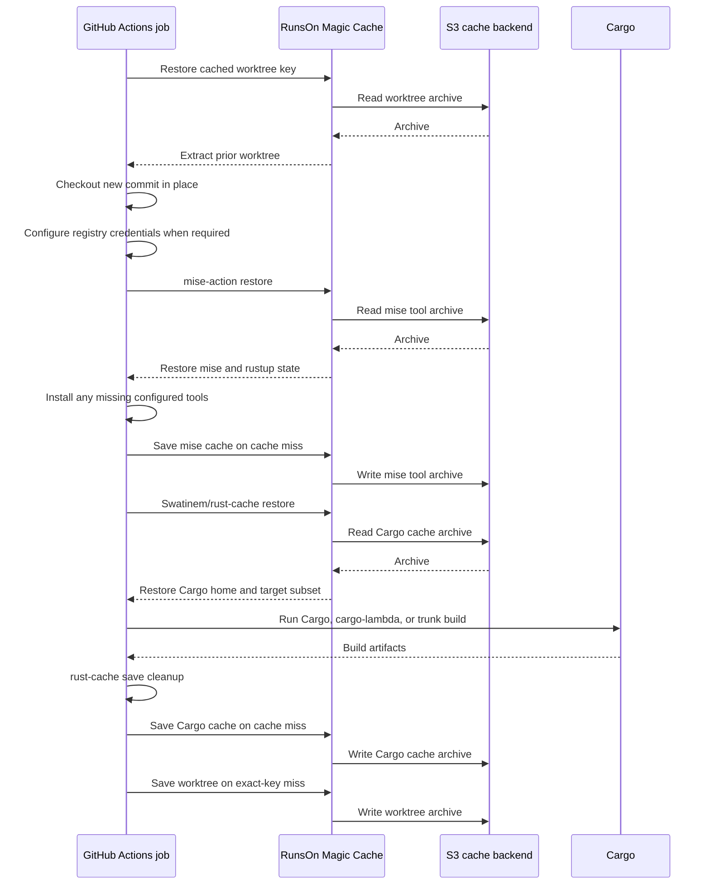

# RunsOn Magic Cache Details

This page preserves the detailed state ownership and backend-flow diagrams behind the [RunsOn Magic Cache deployment](../deployments/runs-on/README.md).

## Cache Ownership

Each layer owns a different kind of state:

| State | Owner | Why |
| --- | --- | --- |
| Source worktree and unchanged source mtimes | `actions/cache` with the cached-worktree checkout | Prevents normal checkout from making unchanged source files appear newer than restored Cargo outputs. |
| Rust toolchain, rustup targets, Zig, and Cargo-distributed helper tools | `jdx/mise-action` | Mise installs and caches tools under `MISE_DATA_DIR`; these are setup state, not Cargo freshness state. |
| Cargo registry and Git dependency state | `Swatinem/rust-cache` | Keeps dependency downloads and sources aligned with the workspace dependency graph. |
| Dependency and workspace-library target state | `Swatinem/rust-cache` | Restores the target metadata and artifacts used by Cargo's freshness checks, subject to `rust-cache` cleanup. |
| Final build output location | Explicit stable `CARGO_TARGET_DIR` | Keeps restored target paths consistent between jobs. |

Keep these ownership boundaries strict. In particular, declare stable helper tools in mise instead of installing them separately with `cargo install`, and do not place `CARGO_HOME` under `MISE_DATA_DIR`.

## Backend Boundary

The S3 backend changes cache transport and storage. It does not change cache keys, archive extraction, `rust-cache` cleanup, or exact-hit save behavior.

## Job Sequence

