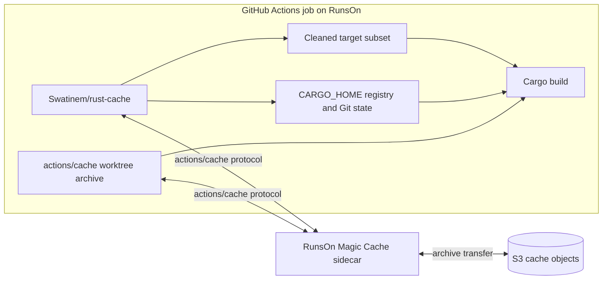
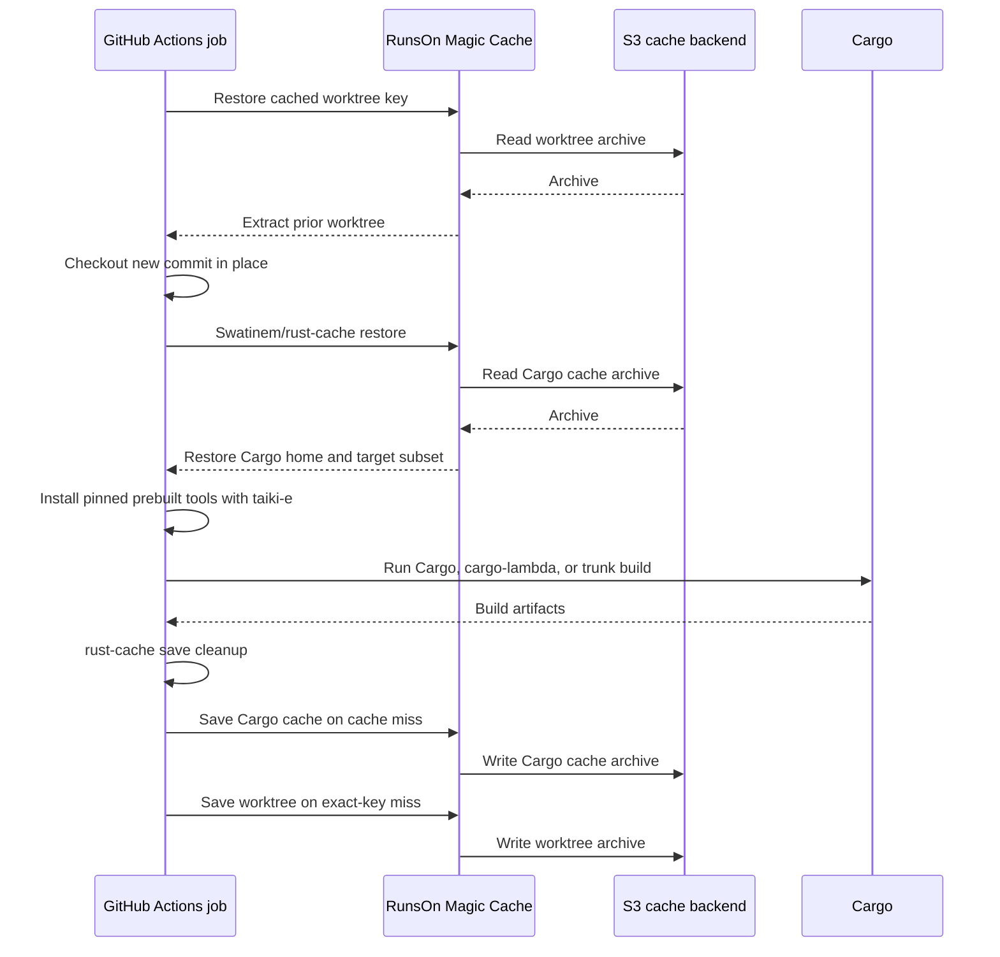

# RunsOn Magic Cache

This page maps the repository's recommended Cargo cache approach onto RunsOn.
RunsOn Magic Cache supplies an S3-backed implementation of the
`actions/cache` protocol; `Swatinem/rust-cache` still decides which Cargo
paths are restored, cleaned, and saved.

## Documentation Ownership

This page owns the selected RunsOn deployment:

- Runner and Magic Cache setup.
- S3 backend boundaries.
- The combined worktree, `rust-cache`, and taiki-e workflow shape.
- RunsOn-specific configuration and maintenance assumptions.

Other pages should link here instead of repeating that guidance. Empirical
measurements remain under `docs/results/`, and archived snapshot or S3 Files
implementations remain with their approach and action documentation.

## Selected Architecture

Use these layers together:

```text
RunsOn runner with Magic Cache / S3 backend
actions/cache for the mtime-preserving source worktree
Swatinem/rust-cache for Cargo home and target state
taiki-e/install-action for pinned prebuilt development tools
stable explicit CARGO_TARGET_DIR for the build
```

Do not add an EBS filesystem snapshot to this design. It is a separate
archived approach with different restore and lifecycle semantics.

## Backend Boundary



The S3 backend changes cache transport and storage. It does not change cache
keys, archive extraction, `rust-cache` cleanup, or exact-hit save behavior.

## Job Sequence



## `rust-cache` Inputs

RunsOn does not require different `rust-cache` inputs.
[Magic Cache](https://runs-on.com/caching/magic-cache/) transparently replaces
the `actions/cache` storage backend, while `rust-cache` retains the same path
selection, keying, cleanup, and save behavior used with GitHub's hosted cache
service.

Use the same approach-defining inputs as the generic mtime-preserving checkout:

```yaml
- uses: Swatinem/rust-cache@v2
  with:
    workspaces: ./app -> ../../target-for-job
    cache-targets: true
    cache-workspace-crates: true
    shared-key: app-target-v1
```

- `cache-targets: true`: include the configured target directory.
- `cache-workspace-crates: true`: retain matching workspace library artifacts
  through target cleanup.

Choose `cache-all-crates` and `cache-bin` from the complete workflow, not from
the cache backend:

- Keep the `cache-all-crates: false` default unless another step needs registry
  crates outside the workspace dependency graph.
- Keep the `cache-bin: true` default when another step installs
  Cargo-registered binaries. Set it to `false` when the workflow has none.
- A normal `taiki-e/install-action` prebuilt installation does not require
  either `cache-all-crates: true` or `cache-bin: true`.

See [`rust-cache` behavior](../concepts/rust-cache-behavior.md) for exact input
semantics and cleanup rules.

## Workflow Shape

Enable RunsOn Magic Cache and initialize RunsOn before using
`actions/cache` or `Swatinem/rust-cache`:

```yaml
jobs:
  build:
    runs-on: runs-on=${{ github.run_id }}-cargo/cpu=16/image=ubuntu24-full-x64/extras=s3-cache

    steps:
      - name: Setup RunsOn Magic Cache
        uses: runs-on/action@v2
```

Then follow the generic
[mtime-preserving checkout workflow](../../examples/workflows/rust-cache-mtime-checkout.yml).
Keep the example's stable worktree, target paths, and `rust-cache` inputs.
RunsOn adds no backend-specific `rust-cache` input.

## Prebuilt Development Tools

Keep tools such as `cargo-lambda` and `trunk` pinned and let
`taiki-e/install-action` install them in each job. Both are supported through
prebuilt release manifests rather than normal `cargo install` compilation.

Only add a separate cache for taiki's installation directory if measurements
show that setup time is significant. Do not broaden Cargo registry caching to
solve a release-binary download.

See the
[`rust-cache` prebuilt-tool explanation](../concepts/rust-cache-behavior.md#tool-example-taiki-e-prebuilt-tools)
for the canonical details about Cargo installation metadata, `cache-bin`
cleanup, and taiki's current reinstall behavior.

## Maintenance

Before changing this platform shape, verify the current RunsOn runner-label
syntax, Magic Cache setup, S3 backend behavior, and `runs-on/action` major.
Keep those platform-specific assumptions on this page rather than copying
them into generic Cargo approach pages.

## Related Evidence

- [Recommended cache approach](../approaches/rust-cache-mtime-checkout.md)
- [Cache primitive boundaries](../concepts/cache-primitives.md)
- [Empirical results](../results/empirical-results.md)
- [Observed RunsOn cache object shape](../results/empirical-results.md#observed-magic-cache-object-shape)
