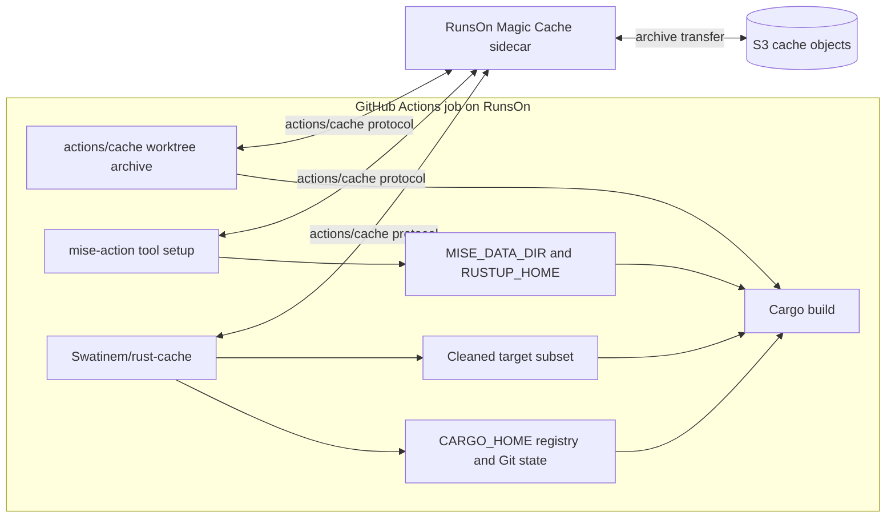
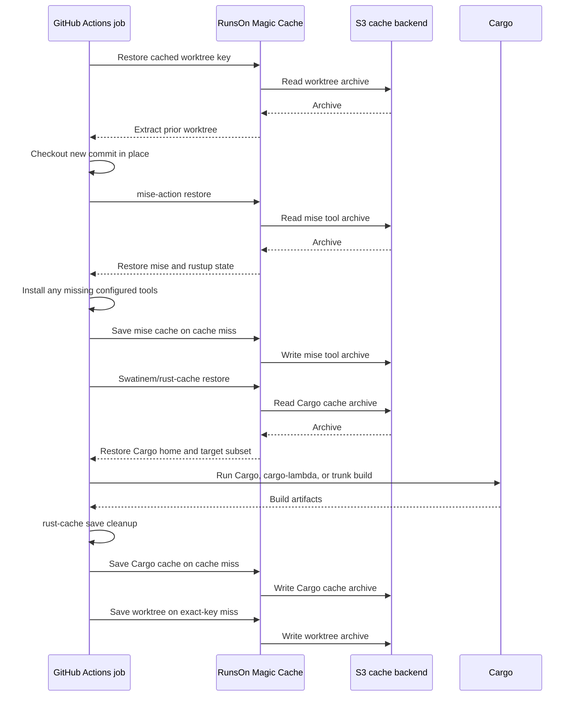

# RunsOn Magic Cache

This page maps the repository's recommended Cargo cache approach onto RunsOn. RunsOn Magic Cache supplies an S3-backed implementation of the `actions/cache` protocol; `Swatinem/rust-cache` still decides which Cargo paths are restored, cleaned, and saved.

## Documentation Ownership

This page owns the selected RunsOn deployment:

- Runner and Magic Cache setup.
- S3 backend boundaries.
- The combined worktree, mise, and `rust-cache` workflow shape.
- RunsOn-specific configuration and maintenance assumptions.

Other pages should link here instead of repeating that guidance. Measurements remain under `docs/evidence/`, and archived snapshot or S3 Files implementations remain with their approach and action documentation.

## Selected Architecture

Use these layers together:

```text
RunsOn runner with Magic Cache / S3 backend
actions/cache for the mtime-preserving source worktree
mise-action for Rust, Zig, targets, and helper tools
Swatinem/rust-cache for Cargo home and target state
stable explicit CARGO_TARGET_DIR for the build
```

Do not add an EBS filesystem snapshot to this design. It is a separate archived approach with different restore and lifecycle semantics.

## Backend Boundary



The S3 backend changes cache transport and storage. It does not change cache keys, archive extraction, `rust-cache` cleanup, or exact-hit save behavior.

## Job Sequence



## `rust-cache` Inputs

RunsOn does not require different `rust-cache` inputs. [Magic Cache](https://runs-on.com/caching/magic-cache/) transparently replaces the `actions/cache` storage backend, while `rust-cache` retains the same path selection, keying, cleanup, and save behavior used with GitHub's hosted cache service.

Use the same approach-defining inputs as the generic mtime-preserving checkout:

```yaml
- uses: Swatinem/rust-cache@v2
  with:
    workspaces: ./app -> ../../target-for-job
    cache-targets: true
    cache-workspace-crates: true
    shared-key: app-target-v1
```

- `cache-targets: true`: include the configured target directory.
- `cache-workspace-crates: true`: retain matching workspace library artifacts through target cleanup.

Choose `cache-all-crates` and `cache-bin` from the complete workflow, not from the cache backend:

- Keep the `cache-all-crates: false` default unless another step needs registry crates outside the workspace dependency graph.
- Keep the `cache-bin: true` default when another step installs Cargo-registered binaries. Set it to `false` when the workflow has none.
- Tools managed by mise do not require broader `rust-cache` registry or binary caching; mise owns their installation cache.

See [`rust-cache` behavior](../concepts/rust-cache-behavior.md) for exact input semantics and cleanup rules.

## Workflow Shape

Enable RunsOn Magic Cache and initialize RunsOn before using `actions/cache`, `jdx/mise-action`, or `Swatinem/rust-cache`:

```yaml
jobs:
  build:
    runs-on: runs-on=${{ github.run_id }}-cargo/cpu=16/image=ubuntu24-full-x64/extras=s3-cache

    steps:
      - name: Setup RunsOn Magic Cache
        uses: runs-on/action@v2
```

Then follow the generic [mtime-preserving checkout workflow](../../examples/workflows/rust-cache-mtime-checkout.yml), adding `mise-action` after checkout and registry credential setup but before `rust-cache`. Keep the example's stable worktree, target paths, and `rust-cache` inputs. RunsOn adds no backend-specific `rust-cache` input.

## Tool Setup

Use `jdx/mise-action@v4` with inline `mise_toml` as the selected setup layer for Rust, targets, Zig, `cargo-binstall`, `cargo-lambda`, `trunk`, and similar tools. Its `actions/cache` integration uses the same Magic Cache backend as the worktree and Cargo caches.

Keep Cargo home separate from the mise cache, especially when registry credentials are written there. If source-keyed target caching is in use, bump its namespace after changing toolchain locations, targets, installer backends, wrappers, or build flags.

See [Mise Tool Setup](../operations/mise-tool-setup.md) for the copyable configuration, environment variables, ordering, and target-key rules. The [`rust-cache` taiki-e explanation](../concepts/rust-cache-behavior.md#tool-example-taiki-e-prebuilt-tools) remains useful when maintaining workflows that still use that installer.

## Maintenance

Before changing this platform shape, verify the current RunsOn runner-label syntax, Magic Cache setup, S3 backend behavior, and `runs-on/action` major. Keep those platform-specific assumptions on this page rather than copying them into generic Cargo approach pages.

## Related Pages

- [Recommended cache approach](../approaches/rust-cache-mtime-checkout.md)
- [Mise tool setup](../operations/mise-tool-setup.md)
- [Cache primitive boundaries](../concepts/cache-primitives.md)
- [`rust-cache` vs EBS snapshot evidence](../evidence/rust-cache-vs-snapshot.md)
- [Observed RunsOn cache object shape](../evidence/rust-cache-vs-snapshot.md#magic-cache-object-shape)
